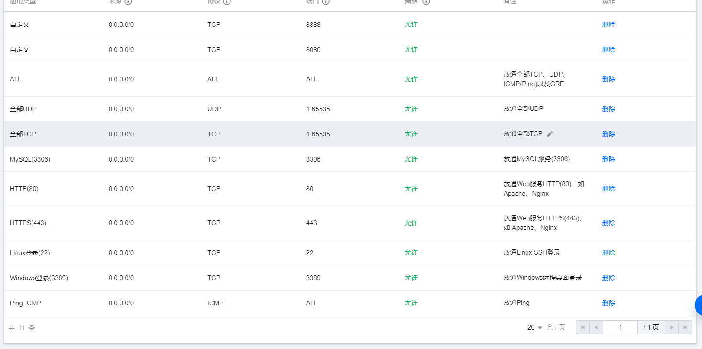
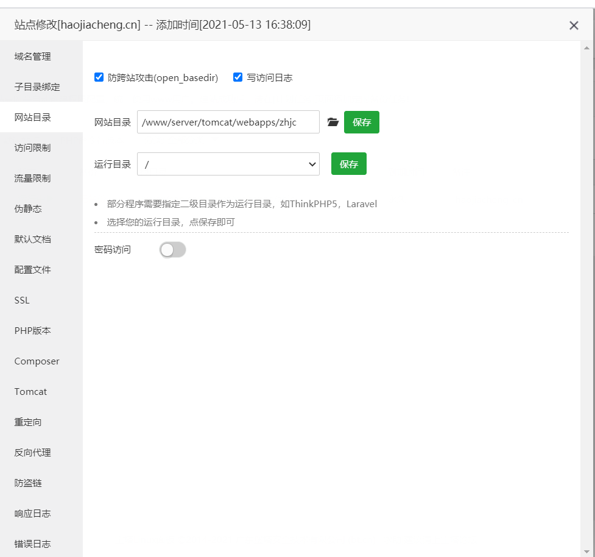
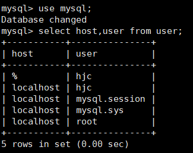
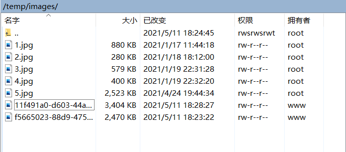

# Linux系统部署SpringBoot项目

## 服务器环境准备 准备jdk，Nginx，MySQL

宝塔安装

Centos安装命令：

```bash
yum install -y wget && wget -O install.sh http://download.bt.cn/install/install_6.0.sh && sh install.sh
```

1. 使用宝塔安装tomcat8（tomcat8会自带jdk8的环境）
2. 安装Nginx（待会配置域名）
3. 安装MySQL（服务使用线上数据库，当然你在打jar包之前就要配置好数据库了）

## 运行jar包

1. 将jar包上传到服务器上（哪里都行，你能找到就好）
2. 使用命令云jar包
   使用项目中默认的端口号

```bash
java -jar springboot-Linux-0.0.1-SNAPSHOT.jar --server.port=8080 >temp.txt &
#持续在Linux服务器上运行jar包
nohup java -jar springboot-Linux-0.0.1-SNAPSHOT.jar --server.port=8080 >temp.txt &
```

查看运行日志

```bash
cat temp.txt
```

#### 如何关闭服务？

1. 查看进程号

```bash
ps -ef|grep java
```

2. 杀死进程

```bash
kill -s 9  104373
```

# 配置域名  (war包)

1. 腾讯云或阿里云申请域名，解析域名，甚至域名备案；

2. 腾讯云或阿里云端口号：`8080` `80` `3306` `22` `21` 等确认开放，并与宝塔面板端口开放保持一致
   

   

3. 打开宝塔的tomcat的配置文件，配置项目路径：   ==不必改端口号为80==

   ~~~xml
   <Host autoDeploy="true" name="haojiacheng.cn" unpackWARs="true" xmlNamespaceAware="false" xmlValidation="false">
   	<Context crossContext="true" docBase="/www/server/tomcat/webapps/zhjc" path="" reloadable="true" />
   	<Context docBase="/temp/images" path="/pic" />
   </Host>
   ~~~

4. 点击，网站--------》添加站点--------》

   1. 有域名写域名，没域名写服务器外网IP
   2. 备注，FTP等看个人需求
   3. 根目录稍后设置
      

5. 添加完成后，测试在浏览器URL中直接输入服务器IP或域名，看是否显示站点创建成功。若成功，则去设置里改网站目录：  为自己的项目目录
   


# ==404 not found nginx怎么解决方法==

# 或==网页的静态资源无法访问==

打开宝塔面板== =》网站== =》站点设置====》配置文件

添加或修改如下代码：

~~~properties
location ~ .*\.(gif|jpg|jpeg|bmp|png|ico|txt|js|css)$
{
    #expires      12h;
    proxy_pass http://haojiacheng.cn:8080;
}
location ~ .*\.(js|css)?$
{
    proxy_pass http://haojiacheng.cn:8080;
}
~~~


# 注意：

1. ## 使用thymeleaf摸版引擎在服务器上面出现的一种报错

   ```yaml
   spring:
    thymeleaf:
     prefix: classpath:/templates/
   ```

2. ## 宝塔账号

```tex
外网面板地址: http://82.156.186.10:8888/612181c6
内网面板地址: http://10.0.8.8:8888/612181c6
username: suyi
password: Hjc17691324608
```


# Linux操作数据库

腾讯云与宝塔面板都开启==3306==端口

宝塔面板给服务器安装MySQL

使用Xshell7 连接服务器，进入MySQL

`mysql -u root -p`

`123456`

`use mysql`

`select host,user from user;`



给与root最高权限，并且不限制访问主机ip，赋予密码123456

`GRANT ALL PRIVILEGES ON *.* TO root@"%" IDENTIFIED BY "123456";`

接下来直接在本地连接MySQL


Linux系统下的java代码===》文件上传下载

在Linux根目录下创建temp>images



并且给与temp和images这两个文件夹最高权限   否则java上传文件放不进来


**Linux下的目录是**：`File file=new File("/temp/images/"+newname+sux);`

**windows下的目录是**: `File file=new File("C:\\temp\\images\\"+newname+sux);`

