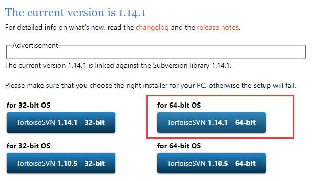
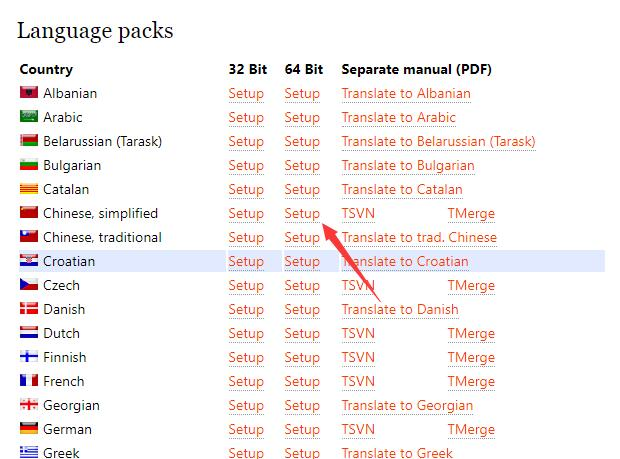
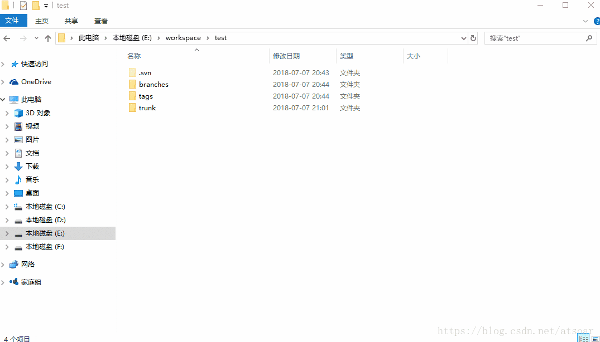
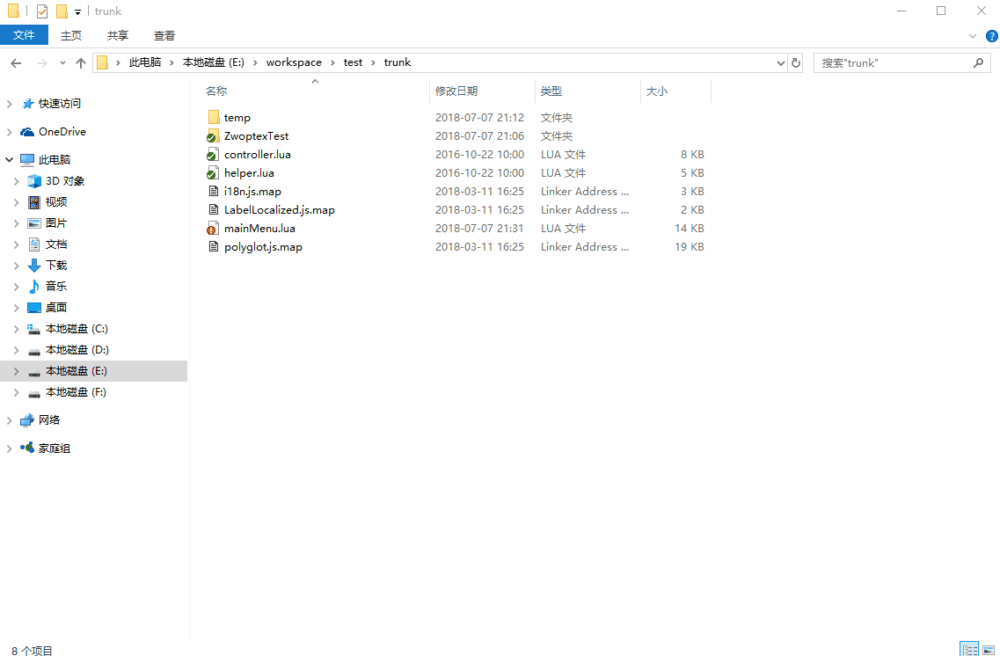
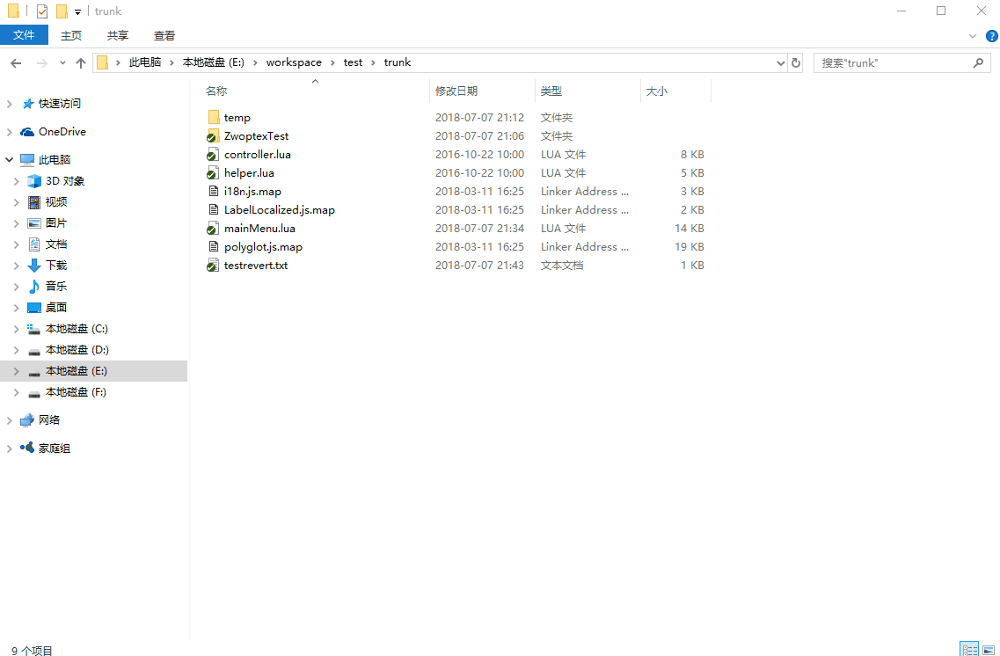

# SVN学习

svn基本操作：

- 检出：checkout
- 新增：add
- 提交：commit
- 更新：update
- 历史记录

## 下载

-  TortoiseSVN  
- 汉化

##    Checkout检出代码 

1. 在SVNBucket的项目详情-源码页面-复制SVN地址
2. 在你需要保存代码的地方右键选择`SVN Chekout...`
3. 填写SVN地址，填写保存目录，输入SVNBucket网站登录用户名密码。
4. 点击确定就能同步代码到本地了。

## Update更新代码 

右键 SVN Update 更新代码，这样就能把其他人提交的代码同步到自己电脑上了 

## Commit提交代码 

提交代码也很简单，右键`SVN Commit...`，填入提交描述，就可以把本地提交的代码提交到服务器了。 在提交代码前我们应该`update`下代码，这是个好习惯，可以避免覆盖别人的代码和代码冲突。 

  

## 撤销和恢复

- 撤销本地修改
- 撤销已提交内容
- 恢复到指定版本

### 本地：

### 已提交

### 恢复到指定版本  

 **右键==》TortoiseSVN＝=》显示日志**

- 选择恢复到此版本   **==或==**
- 恢复此版本做出的修改

## 忽略

 **右键==》TortoiseSVN＝=》增加到忽略列表**

## 取消忽略

**右键==》TortoiseSVN＝=》从忽略列表删除**

## 冲突

### 什么情况容易发生冲突？

- 多个人修改了同个文件的同一行
- 无法进行合并的二进制文件

#### 怎么避免冲突

- 经常update同步他人代码
- 二进制文件不要多个人同时操作

### 冲突了怎么办

更新时发生冲突，可以选择

- 使用“他们的”文本块解决冲突
- 使用“我的”解决有冲突的文件
- 编辑冲突，选择好时，右键==》使用此文本块

## 什么时候需要开分支？

- 隔离线上版本和开发版本
- 大功能开发，不想影响到其他人，自己独立开个分支去开发

SVN经典目录结构

- trunk
- branches
- tags