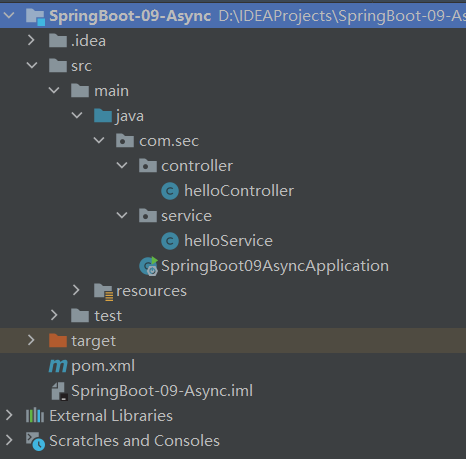
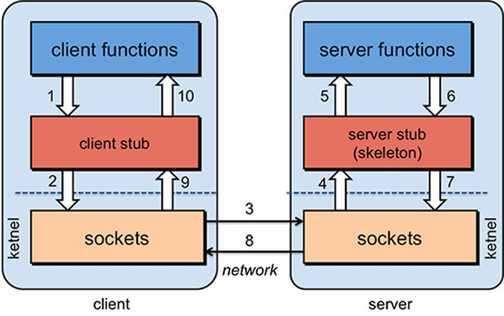
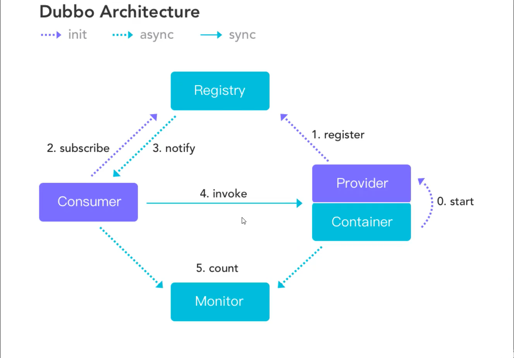
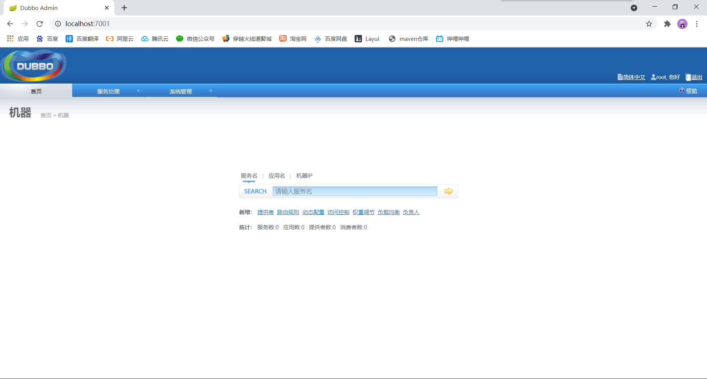
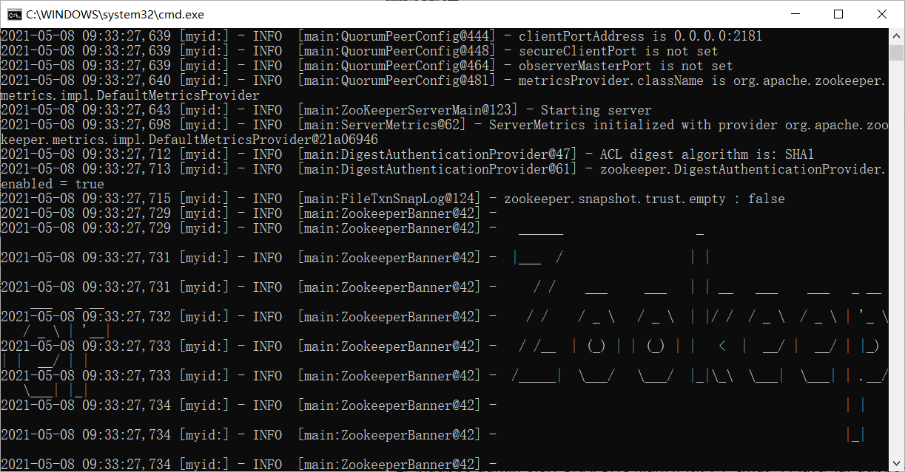
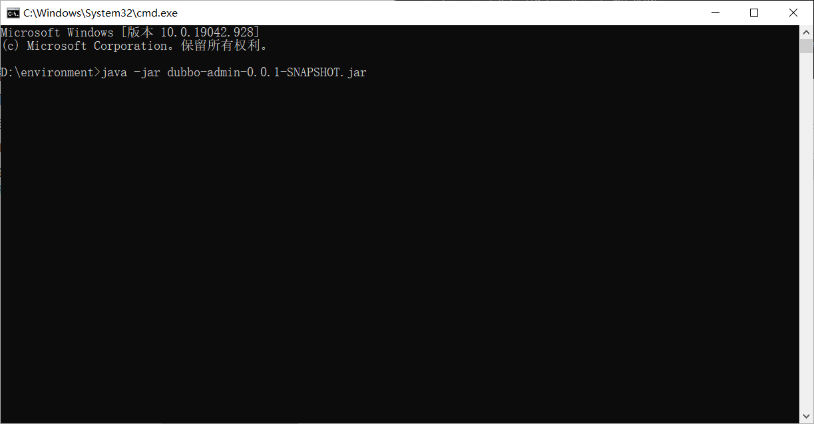
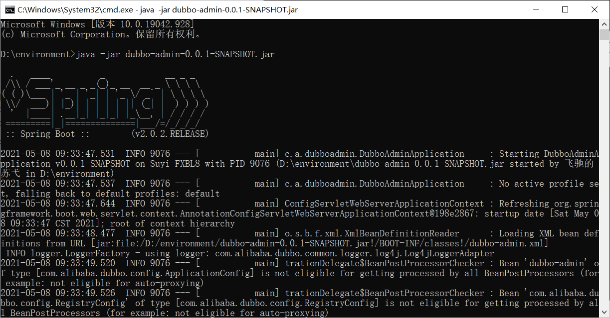
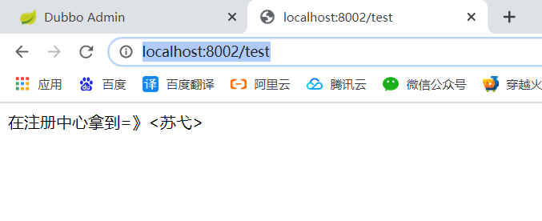

# SpringBoot：快速入门（续）

## 异步任务：

目录结构

helloController：

~~~java
package com.sec.controller;

import com.sec.service.helloService;
import org.springframework.beans.factory.annotation.Autowired;
import org.springframework.scheduling.annotation.EnableAsync;
import org.springframework.web.bind.annotation.RequestMapping;
import org.springframework.web.bind.annotation.RestController;

@RestController
@EnableAsync//开启异步任务
public class helloController {

@Autowired
helloService hs;
@RequestMapping("/hello")
public String test(){
    hs.hello();//停止三秒
    return "ok";
}
}

~~~

helloService：

~~~java
package com.sec.service;

import org.springframework.scheduling.annotation.Async;
import org.springframework.stereotype.Service;

@Service
public class helloService {

@Async//告诉spring 这是一个异步方法
public void hello(){
    try {
        Thread.sleep(3000);//睡眠三秒
    } catch (InterruptedException e) {
        e.printStackTrace();
    }
    System.out.println("数据正在处理中");
}
}

~~~

==**注意：**==

- 首先要给方法前面写上注解@Async，告诉spring这是一个异步方法
- 然后要在controller类前开启异步任务 @EnableAsync

## 邮件发送：

1. 导入依赖：

   ~~~xml
   <dependency>
           <groupId>org.springframework.boot</groupId>
           <artifactId>spring-boot-starter-mail</artifactId>
   </dependency>
   ~~~

2. 编写代码

   ~~~java
   package com.sec;
   
   import org.junit.jupiter.api.Test;
   import org.springframework.beans.factory.annotation.Autowired;
   import org.springframework.boot.test.context.SpringBootTest;
   import org.springframework.mail.SimpleMailMessage;
   import org.springframework.mail.javamail.JavaMailSenderImpl;
   import org.springframework.mail.javamail.MimeMessageHelper;
   
   import javax.mail.MessagingException;
   import javax.mail.internet.MimeMessage;
   import java.io.File;
   import java.util.Random;
   
   @SpringBootTest
   class SpringBoot09AsyncApplicationTests {
   
       @Autowired
       JavaMailSenderImpl jsi;
   
       @Test
       //一个简单的邮件发送
       void contextLoads() {
           SimpleMailMessage mailMessage = new SimpleMailMessage();
           mailMessage.setSubject("郝嘉诚你好啊！");
           mailMessage.setText("感谢你的代码");
           mailMessage.setFrom("990784805@qq.com");
           mailMessage.setTo("990784805@qq.com");
           jsi.send(mailMessage);
       }
   
       @Test
           //一个复杂的邮件发送
       void contextLoads1() throws MessagingException {
           MimeMessage mimeMessage = jsi.createMimeMessage();
           //组装
           MimeMessageHelper messageHelper=new MimeMessageHelper(mimeMessage,true);
           //正文
           messageHelper.setSubject("尊敬的苏弋您好！");
           Random random = new Random();
           int num = random.nextInt(9000) + 1000;
           messageHelper.setText("
您的验证码是："+num+"
",true);
   
           //附件
           messageHelper.addAttachment("1.jpg",new File("C:\\Users\\飞驰的苏弋\\Pictures\\Camera Roll\\1.jpg"));
           messageHelper.addAttachment("2.jpg",new File("C:\\Users\\飞驰的苏弋\\Pictures\\Camera Roll\\2.jpg"));
   
           //发送
           messageHelper.setFrom("990784805@qq.com");
           messageHelper.setTo("3046865110@qq.com");
   
           jsi.send(mimeMessage);
   
       }
   
   	//把发送邮件的代码编写成了一个工具，可调用
       public void sendMail(Boolean html,String title,String text,Boolean textHtml,String sendFrom,String sendTo,String fileName,File file) throws MessagingException{
           MimeMessage mimeMessage = jsi.createMimeMessage();
           //组装
           MimeMessageHelper messageHelper=new MimeMessageHelper(mimeMessage,html);
           //正文
           messageHelper.setSubject(title);
   
           messageHelper.setText(text,textHtml);
   
           //附件
           messageHelper.addAttachment(fileName,file);
   
           //发送
           messageHelper.setFrom(sendFrom);
           messageHelper.setTo(sendTo);
   
           jsi.send(mimeMessage);
       }
   
   }
   
   ~~~

### 工具类调用法：

- 发送邮件工具类：sendMail.java

~~~java
package com.sec.service;

import org.springframework.beans.factory.annotation.Autowired;
import org.springframework.mail.javamail.JavaMailSenderImpl;
import org.springframework.mail.javamail.MimeMessageHelper;
import org.springframework.stereotype.Component;
import org.springframework.stereotype.Service;

import javax.mail.MessagingException;
import javax.mail.internet.MimeMessage;
import java.io.File;
import java.util.Random;

@Service
public class sendMail {

    @Autowired
    JavaMailSenderImpl jsi;
    public void sendMail(Boolean html, String title, String text, Boolean textHtml, String sendFrom, String sendTo, String fileName, File file) throws MessagingException {
        MimeMessage mimeMessage = jsi.createMimeMessage();
        //组装
        MimeMessageHelper messageHelper=new MimeMessageHelper(mimeMessage,html);
        //正文
        messageHelper.setSubject(title);

        messageHelper.setText(text,textHtml);

        //附件
        messageHelper.addAttachment(fileName,file);

        //发送
        messageHelper.setFrom(sendFrom);
        messageHelper.setTo(sendTo);

        jsi.send(mimeMessage);
    }

    public void hjc() throws MessagingException {
        MimeMessage mimeMessage = jsi.createMimeMessage();
        //组装
        MimeMessageHelper messageHelper=new MimeMessageHelper(mimeMessage,true);
        //正文
        messageHelper.setSubject("尊敬的苏弋您好！");
        Random random = new Random();
        int num = random.nextInt(9000) + 1000;
        messageHelper.setText("
您的验证码是："+num+"
",true);

        //附件
        messageHelper.addAttachment("1.jpg",new File("C:\\Users\\飞驰的苏弋\\Pictures\\Camera Roll\\1.jpg"));
        messageHelper.addAttachment("2.jpg",new File("C:\\Users\\飞驰的苏弋\\Pictures\\Camera Roll\\2.jpg"));

        //发送
        messageHelper.setFrom("990784805@qq.com");
        messageHelper.setTo("3046865110@qq.com");

        jsi.send(mimeMessage);
    }
}

~~~

- controller层调用：

  ~~~java
  package com.sec.controller;
  
  import com.sec.service.helloService;
  import com.sec.service.sendMail;
  import org.springframework.beans.factory.annotation.Autowired;
  import org.springframework.mail.javamail.JavaMailSenderImpl;
  import org.springframework.mail.javamail.MimeMessageHelper;
  import org.springframework.scheduling.annotation.EnableAsync;
  import org.springframework.stereotype.Controller;
  import org.springframework.ui.Model;
  import org.springframework.web.bind.annotation.RequestMapping;
  import org.springframework.web.bind.annotation.ResponseBody;
  import org.springframework.web.bind.annotation.RestController;
  
  import javax.mail.MessagingException;
  import javax.mail.internet.MimeMessage;
  import javax.servlet.http.HttpSession;
  import java.io.File;
  
  @Controller
  @EnableAsync//开启异步任务
  public class helloController {
  
  @Autowired
  helloService hs;
  
  @Autowired
  sendMail sm;
  
  @RequestMapping({"/","/index","/index.html"})
  public String index(){
      return "/index";
  }
  
  
  @RequestMapping("/hello")
  @ResponseBody
  public String test(){
      hs.hello();//停止三秒
      return "ok";
  }
  
  @RequestMapping("/sendMail")
  public String sendMail(Model model) throws MessagingException {
      sm.sendMail(true,"飞驰的苏弋你好！","<h2 style='color:red'>你好呀飞驰的苏弋</h2>",true,"990784805@qq.com","3046865110@qq.com","5.png",new File("C:\\Users\\飞驰的苏弋\\Pictures\\Camera Roll\\5.png"));
      model.addAttribute("msg","发送成功");
      return "/index";
  }
  }
  
  ~~~

- index.html页面编写一个按钮  结合Thymeleaf

  ~~~html
  <!DOCTYPE html>
  <html lang="en" xmlns:th="http://www.thymeleaf.org">
  <head>
      <meta charset="UTF-8">
      <title>Title</title>
  </head>
  <body>
  

      

  

  <a th:href="@{/sendMail}">点击发送邮箱</a>
  </body>
  </html>
  ~~~

  

##  定时任务：

~~~
TaskScheduler	任务调度者
TaskExecutor	任务执行者

@EnableScheduling	//开启定时功能的注解
@Scheduled	//什么时候执行
~~~

1. 开启定时功能

   ~~~java
   @EnableAsync//开启异步任务
   @EnableScheduling//开启定时功能的注解
   @SpringBootApplication
   public class SpringBoot09AsyncApplication {
   public static void main(String[] args) {
       SpringApplication.run(SpringBoot09AsyncApplication.class, args);
   }
   }
   ~~~

2. 编写定时任务的类
   cron表达式：是一个字符串，字符串以5或6个空格隔开，分为6或7个域，每一个域代表一个含义 

   corn从左到右（用空格隔开）：==秒  分  时  日  月  周几  年== 

   ==**注意事项：**==

   　　每一个域都使用数字，但还可以出现如下特殊字符，它们的含义是：

   　　（1）✳：表示匹配该域的任意值。假如在Minutes域使用✳, 即表示每分钟都会触发事件。

   　　（2）?：只能用在DayofMonth和DayofWeek两个域。它也匹配域的任意值，但实际不会。因为DayofMonth和DayofWeek会相互影响。例如想在每月的20日触发调度，不管20日到底是星期几，则只能使用如下写法： 13 13 15 20 * ?, 其中最后一位只能用？，而不能使用*，如果使用*表示不管星期几都会触发，实际上并不是这样。

   　　（3）-：表示范围。例如在Minutes域使用5-20，表示从5分到20分钟每分钟触发一次 

   　　（4）/：表示起始时间开始触发，然后每隔固定时间触发一次。例如在Minutes域使用5/20,则意味着5分钟触发一次，而25，45等分别触发一次. 

   　　（5）,：表示列出枚举值。例如：在Minutes域使用5,20，则意味着在5和20分每分钟触发一次。 

   　　（6）L：表示最后，只能出现在DayofWeek和DayofMonth域。如果在DayofWeek域使用5L,意味着在最后的一个星期四触发。 

   　　（7）W:表示有效工作日(周一到周五),只能出现在DayofMonth域，系统将在离指定日期的最近的有效工作日触发事件。例如：在 DayofMonth使用5W，如果5日是星期六，则将在最近的工作日：星期五，即4日触发。如果5日是星期天，则在6日(周一)触发；如果5日在星期一到星期五中的一天，则就在5日触发。另外一点，W的最近寻找不会跨过月份 。

   　　（8）LW:这两个字符可以连用，表示在某个月最后一个工作日，即最后一个星期五。 

   　　（9）#:用于确定每个月第几个星期几，只能出现在DayofMonth域。例如在4#2，表示某月的第二个星期三。

   ~~~java
   @Service
   public class ScheduledService {
   //在一个特定的时间执行这个方法  Timer
   //cron表达式
   //秒  分  时  日  月  周几
   @Scheduled(cron = "59 7 19 * * ?")//每天的下午7点07分59秒执行
   public void hello(){
       System.out.println("hello，你被执行了");
   }
   }
   ~~~

## RPC

- 简单的说，RPC就是从一台机器（客户端）上通过参数传递的方式调用另一台机器（服务器）上的一个函数或方法（可以统称为服务）并得到返回的结果。
- RPC 会隐藏底层的通讯细节（不需要直接处理Socket通讯或Http通讯）
- RPC 是一个请求响应模型。客户端发起请求，服务器返回响应（类似于Http的工作方式）
- RPC 在使用形式上像调用本地函数（或方法）一样去调用远程的函数（或方法）。

## 分布式Dubbo + Zookeeper + SpringBoot

### 什么是dubbo？

Apache Dubbo 是一款高性能、轻量级的开源java RPC框架，它提供了三大核心能力：面向接口的远程方法调用，智能容错和负载均衡，以及服务自动注册和发现。

#### dubbo的好处

1. 透明化的远程方法调用，就像调用本地方法一样调用远程方法，只需简单配置，没有任何API侵入。
2. 软负载均衡及容错机制，可在内网替代F5等硬件负载均衡器，降低成本，减少单点。
3. 服务自动注册与发现，不再需要写死服务提供方地址，注册中心基于接口名查询服务提供者的IP地址，并且能够平滑添加或删除服务提供者。Dubbo采用全Spring配置方式，透明化接入应用，对应用没有任何API侵入，只需用Spring加载Dubbo的配置即可，Dubbo基于Spring的Schema扩展进行加载。

#### dubbo基本概念

**服务提供者（Provider）：**暴露服务的服务提供方，服务提供者在启动时，向注册中心注册自己提供的服务。

**服务消费者（Consumer）：**调用远程服务的服务消费方，服务消费者在启动时，向注册中心订阅自己所需的服务，服务消费者，从提供者地址列表中，基于软负载均衡算法，选一台提供者进行调用，如果调用失败，再选另一台调用。

**注册中心（Registry）：**注册中心返回服务提供者地址列表给消费者，如果有变更，注册中心将基于长连接推送变更数据给消费者。

**监控中心（Monitor）：**服务消费者和提供者，在内存中累计调用次数和调用时间，定时每分钟发送一次统计数据到监控中心。

**调用关系说明**

>服务容器负责启动，加载，运行服务提供者。
>
>服务提供者在启动时，向注册中心注册自己提供的服务。
>
>服务消费者在启动时，向注册中心订阅自己所需的服务。
>
>注册中心返回服务提供者地址列表给消费者，如果有变更，注册中心将基于长连接推送变更数据给消费者。
>
>服务消费者，从提供者地址列表中，基于软负载均衡算法，选一台提供者进行调用，如果调用失败，再选另一台调用。
>
>服务消费者和提供者，在内存中累计调用次数和调用时间，定时每分钟发送一次统计数据到监控中心。

### zookeeper

ZooKeeper是一个经典的分布式数据一致性解决方案，致力于为分布式应用提供一个高性能、高可用，且具有严格顺序访问控制能力的分布式协调服务。
分布式应用程序可以基于ZooKeeper实现数据发布与订阅、负载均衡、命名服务、分布式协调与通知、集群管理、Leader选举、分布式锁、分布式队列等功能。 

### dubbo-admin安装测试

1. 下载dubbo-admin
   地址：https://github.com/apache/dubbo-admin/tree/master

2. 解压进入目录
   修改dubbo-admin\src\main\resource\application.properties  指定zookeeper地址

   ~~~properties
   server.port=7001
   spring.velocity.cache=false
   spring.velocity.charset=UTF-8
   spring.velocity.layout-url=/templates/default.vm
   spring.messages.fallback-to-system-locale=false
   spring.messages.basename=i18n/message
   spring.root.password=root
   spring.guest.password=guest
   
   dubbo.registry.address=zookeeper://127.0.0.1:2181
   ~~~

3. 在项目目录下打包dubbo-admin

   ~~~
   mvn clean package -Dmaven.test.skip=true
   ~~~

   第一次打包比较慢，耐心等待

4. 执行dubbo-admin\target下的dubbo-admin-SNAPSHOT.jar

   ~~~
   java -jar dubbo-admin-SNAPSHOT.jar
   ~~~

   【注意：zookeeper的服务一定要打开】
   执行完毕后，我们去访问http://localhost:7001/ ,这时候我们需要输入账户和密码，我们都是默认的root-root；
   登陆成功后，查看界面
   zookeeper：是一个注册中心
   dubbo-admin：是一个监控管理后台，查看我们注册了那些服务，消费了哪些服务
   Dubbo：jar包
   

安装完成！
SpringBoot+Dubbo+zookeeper

### 服务注册发现实战

导入依赖

~~~xml
<!--导入依赖  Dubbo  zookeeper-->
<dependency>
    <groupId>org.apache.dubbo</groupId>
    <artifactId>dubbo-spring-boot-starter</artifactId>
    <version>2.7.3</version>
</dependency>
<dependency>
    <groupId>com.github.sgroschupf</groupId>
    <artifactId>zkclient</artifactId>
    <version>0.1</version>
</dependency>
<!--日志会冲突-->
<!--引入zookeeper-->
<dependency>
    <groupId>org.apache.curator</groupId>
    <artifactId>curator-framework</artifactId>
    <version>2.12.0</version>
</dependency>
<dependency>
    <groupId>org.apache.curator</groupId>
    <artifactId>curator-recipes</artifactId>
    <version>2.12.0</version>
</dependency>
<dependency>
    <groupId>org.apache.zookeeper</groupId>
    <artifactId>zookeeper</artifactId>
    <version>3.4.14</version>
    <!--排除这个slf4j-log4j12-->
    <exclusions>
        <exclusion>
            <groupId>org.slf4j</groupId>
            <artifactId>slf4j-log4j12</artifactId>
        </exclusion>
    </exclusions>
</dependency>
~~~

框架搭建

1. 启动zookeeper！

2. IDEA创建一个空项目；

3. 创建一个模块，实现服务提供者：provider-server，选择web依赖即可；

4. 项目创建完毕，我们写一个服务，比如卖票的服务；

   编写接口

~~~java
package com.sec.service;

public interface TicketService {
    public String getTicket();
}
~~~

​	编写实现类

provider-server提供的服务添加注解    ==这里@service不要导错包==

~~~java
package com.sec.service;

import org.apache.dubbo.config.annotation.Service;
import org.springframework.stereotype.Component;

@Service    //可以被扫描到，在项目一启动就自动注册到注册中心
@Component  //使用了dubbo后尽量不要用service注解
public class TicketServiceImpl implements TicketService{
    @Override
    public String getTicket() {
        return "<苏弋>";
    }
}

~~~

provider-server的==application.properties:==

~~~properties
server.port=8001

#服务应用名字
dubbo.application.name=provider-server
#注册中心地址
dubbo.registry.address=zookeeper://127.0.0.1:2181
#哪些服务要被注册
dubbo.scan.base-packages=com.sec.service
~~~

再创建一个模块，实现消费者：consumer-server，选择web依赖；

编写类，再把TicketService接口拿到这边的service包下

~~~java
package com.sec.service;

import org.apache.dubbo.config.annotation.Reference;
import org.springframework.stereotype.Service;

@Service
public class UserService {
    //想拿到provider-server提供的票  要去注册中心拿到服务
    @Reference  //引用   Pom坐标，可以定义路径相同的接口名
    TicketService ticketService;
    public String buyTicket(){
        String ticket=ticketService.getTicket();
        System.out.println("在注册中心拿到=>"+ticket);
        return "在注册中心拿到=》"+ticket;
    }
}

~~~

consumer-server的==application.properties==

~~~properties
server.port=8002

#消费去哪里拿服务需要暴露自己的名字
dubbo.application.name=consumer-server
#注册中心的地址
dubbo.registry.address=zookeeper://127.0.0.1:2181
~~~

controller调用buyTicket方法

~~~java
package com.sec.controller;

import com.sec.service.UserService;
import org.springframework.beans.factory.annotation.Autowired;
import org.springframework.stereotype.Controller;
import org.springframework.web.bind.annotation.RequestMapping;
import org.springframework.web.bind.annotation.ResponseBody;

@Controller
public class testController {

    @Autowired
    UserService userService;

    @RequestMapping("/test")
    @ResponseBody
    public String test(){
        String str = userService.buyTicket();
        return str;
    }
}

~~~

代码编写完毕；

#### 测试运行

1. 开启zookeeper服务，找到zkServer.cmd，双击运行。
   
   

2. 到dubbo-admin-0.0.1-SNAPSHOT.jar的目录下，cmd运行 java -jar dubbo-admin-0.0.1-SNAPSHOT.jar。
   
   

3. 开启提供者服务
   

4. 访问http://localhost:7001  查看提供者服务有没有
   

5. 访问http://localhost:8002/test 
   

6. 查看后台Dubbo Admin的消费者是否产生

   

7. 完毕

#### 总结步骤：

前提：zookeeper服务已开启

1. 提供者提供服务
   1. 导入依赖
   2. 配置注册中心的地址，以及服务发现名，和要扫描的包
   3. 在想要被注册的服务上面增加一个注解==@Service==  dubbo的注解
2. 消费者如何消费
   1. 导入依赖
   2. 配置注册中心的地址，配置自己的服务名
   3. 从远程注入服务  @Reference