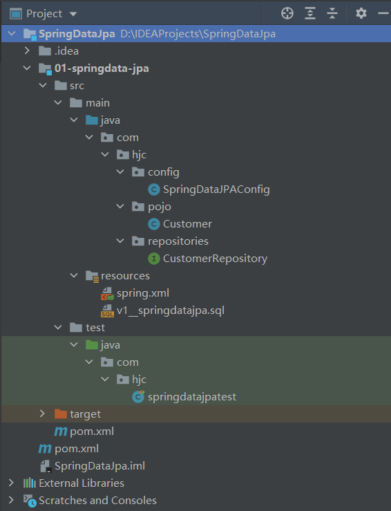

# SpringDataJpa学习笔记

## 一、xml配置方法

### 1、sql脚本

~~~sql
create DATABASE if not exists springdata_jpa
DEFAULT CHARACTER set utf8;

use springdata_jpa;

create table customer(
id int auto_increment PRIMARY KEY,
cust_name VARCHAR(50) DEFAULT '',
cust_address VARCHAR(100) DEFAULT ''
);
insert into customer(cust_name,cust_address)VALUES('张三','陕西省西安市长安区滦镇街道');
select * from customer;
~~~

### 2、导入pom依赖

父项目

~~~xml
<!--统一管理springdata子项目的版本-->
<dependencyManagement>
    <dependencies>
        <dependency>
            <groupId>org.springframework.data</groupId>
            <artifactId>spring-data-bom</artifactId>
            <version>2021.1.0</version>
            <scope>import</scope>
            <type>pom</type>
        </dependency>
    </dependencies>
</dependencyManagement>
~~~

子模块

~~~xml
<dependencies>
    <dependency>
        <groupId>org.springframework.data</groupId>
        <artifactId>spring-data-jpa</artifactId>
    </dependency>
    <dependency>
        <groupId>junit</groupId>
        <artifactId>junit</artifactId>
        <version>4.12</version>
        <scope>test</scope>
    </dependency>
    <dependency>
        <groupId>org.hibernate</groupId>
        <artifactId>hibernate-entitymanager</artifactId>
        <version>5.4.32.Final</version>
    </dependency>
    <dependency>
        <groupId>mysql</groupId>
        <artifactId>mysql-connector-java</artifactId>
        <version>5.1.47</version>
    </dependency>
    <dependency>
        <groupId>com.alibaba</groupId>
        <artifactId>druid</artifactId>
        <version>1.1.16</version>
    </dependency>
    <dependency>
        <groupId>org.springframework</groupId>
        <artifactId>spring-test</artifactId>
        <version>5.3.4</version>
        <scope>test</scope>
    </dependency>
</dependencies>
~~~

### 3、编写实体类pojo

~~~java
package com.hjc.pojo;

import javax.persistence.*;

@Entity
@Table(name = "customer")
public class Customer {
    @Id
    @GeneratedValue(strategy = GenerationType.IDENTITY)
    @Column(name = "id")
    private Long custId;//客户Id

    @Column(name = "cust_name")
    private String custName;//客户名称

    @Column(name = "cust_address")
    private String custAddress;//客户地址

    @Override
    public String toString() {
        return "Customer{" +
                "custId=" + custId +
                ", custName='" + custName + '\'' +
                ", custAddress='" + custAddress + '\'' +
                '}';
    }

    public Long getCustId() {
        return custId;
    }

    public void setCustId(Long custId) {
        this.custId = custId;
    }

    public String getCustName() {
        return custName;
    }

    public void setCustName(String custName) {
        this.custName = custName;
    }

    public String getCustAddress() {
        return custAddress;
    }

    public void setCustAddress(String custAddress) {
        this.custAddress = custAddress;
    }

    public Customer(Long custId, String custName, String custAddress) {
        this.custId = custId;
        this.custName = custName;
        this.custAddress = custAddress;
    }

    public Customer() {
    }
}

~~~

### 4、dao层（repositories）

CustomerRepository.java

~~~java
package com.hjc.repositories;

import com.hjc.pojo.Customer;
import org.springframework.data.repository.CrudRepository;

public interface CustomerRepository extends CrudRepository<Customer,Long> {
}

~~~

### 5、spring配置文件

~~~xml
<?xml version="1.0" encoding="UTF-8"?>
<beans xmlns="http://www.springframework.org/schema/beans"
       xmlns:xsi="http://www.w3.org/2001/XMLSchema-instance"
       xmlns:jpa="http://www.springframework.org/schema/data/jpa"
       xsi:schemaLocation="http://www.springframework.org/schema/beans
       http://www.springframework.org/schema/beans/spring-beans.xsd
       http://www.springframework.org/schema/tx
       http://www.springframework.org/schema/tx/spring-tx.xsd
       http://www.springframework.org/schema/data/jpa
       https://www.springframework.org/schema/data/jpa/spring-jpa.xsd">
    <!--用于整合jpa  @EnableJpaRepositories-->
    <jpa:repositories base-package="com.hjc.repositories"
                      entity-manager-factory-ref="entityManagerFactory"
                      transaction-manager-ref="jpaTransactionManager"/>
    <!--entityManagerFactory-->
    <bean name="entityManagerFactory" class="org.springframework.orm.jpa.LocalContainerEntityManagerFactoryBean">
        <property name="jpaVendorAdapter">
            <bean class="org.springframework.orm.jpa.vendor.HibernateJpaVendorAdapter">
                <property name="generateDdl" value="true"></property>
                <property name="showSql" value="true"></property>
            </bean>
        </property>
        <!--设置实体类的包-->
        <property name="packagesToScan" value="com.hjc.pojo"></property>
        <!--设置数据源  ref导入-->
        <property name="dataSource" ref="dataSource"></property>
    </bean>
    <!--德鲁伊数据源-->
    <bean class="com.alibaba.druid.pool.DruidDataSource" name="dataSource">
        <property name="driverClassName" value="com.mysql.jdbc.Driver"/>
        <property name="url" value="jdbc:mysql://localhost:3306/springdata_jpa?useUnicode=true&amp;characterEncoding=utf8&amp;zeroDateTimeBehavior=convertToNull&amp;useSSL=true&amp;serverTimezone=GMT%2B8"/>
        <property name="username" value="root"/>
        <property name="password" value="123456"/>
    </bean>
    <!--声明式事务-->
    <bean name="jpaTransactionManager" class="org.springframework.orm.jpa.JpaTransactionManager">
        <property name="entityManagerFactory" ref="entityManagerFactory"/>
    </bean>
    <!--注解驱动-->
    <tx:annotation-driven transaction-manager="jpaTransactionManager"/>

</beans>
~~~

### 6、测试CRUD

~~~java
package com.hjc;

import com.hjc.config.SpringDataJPAConfig;
import com.hjc.pojo.Customer;
import com.hjc.repositories.CustomerRepository;
import org.junit.Test;
import org.junit.runner.RunWith;
import org.springframework.beans.factory.annotation.Autowired;
import org.springframework.test.context.ContextConfiguration;
import org.springframework.test.context.junit4.SpringJUnit4ClassRunner;

import java.util.Optional;

@ContextConfiguration("classpath:spring.xml")
//@ContextConfiguration(classes = SpringDataJPAConfig.class)
@RunWith(SpringJUnit4ClassRunner.class)
public class springdatajpatest {

    @Autowired
    CustomerRepository customerRepository;

    //查
    @Test
    public void mytest(){
        Optional<Customer> byId = customerRepository.findById(1L);
        System.out.println(byId.get());
    }

    //增
    @Test
    public void save(){
        Customer customer = new Customer();
        customer.setCustName("王五");
        customer.setCustAddress("kjahsdkanklsjdas");
        Customer save = customerRepository.save(customer);
        System.out.println(save);
    }

    //改
    @Test
    public void update(){
        Customer customer = new Customer();
        customer.setCustId(2L);
        customer.setCustName("李四");
        customer.setCustAddress("北京市海定区update");
        Customer save = customerRepository.save(customer);
        System.out.println(save);
    }

    @Test
    public void findAll(){
        Iterable<Customer> all = customerRepository.findAll();
        System.out.println(all);
    }

    //删
    @Test
    public void delete(){
        customerRepository.deleteById(3L);
    }

}
~~~

## 二、javaConfig方式

同上至第四步

### 4、Java配置文件

~~~java
package com.hjc.config;

import com.alibaba.druid.pool.DruidDataSource;
import org.springframework.context.annotation.Bean;
import org.springframework.context.annotation.Configuration;
import org.springframework.data.jpa.repository.config.EnableJpaRepositories;
import org.springframework.orm.jpa.JpaTransactionManager;
import org.springframework.orm.jpa.LocalContainerEntityManagerFactoryBean;
import org.springframework.orm.jpa.vendor.HibernateJpaVendorAdapter;
import org.springframework.transaction.PlatformTransactionManager;
import org.springframework.transaction.annotation.EnableTransactionManagement;

import javax.persistence.EntityManagerFactory;
import javax.sql.DataSource;

@Configuration
@EnableJpaRepositories(basePackages = "com.hjc.repositories")
@EnableTransactionManagement
public class SpringDataJPAConfig {

    @Bean
    public DataSource dataSource(){
        DruidDataSource dataSource = new DruidDataSource();
        dataSource.setDriverClassName("com.mysql.jdbc.Driver");
        dataSource.setUrl("jdbc:mysql://localhost:3306/springdata_jpa?useUnicode=true&amp;characterEncoding=utf8&amp;zeroDateTimeBehavior=convertToNull&amp;useSSL=true&amp;serverTimezone=GMT%2B8");
        dataSource.setUsername("root");
        dataSource.setPassword("123456");

        return dataSource;
    }

    /**
     * 方法名必须是entityManagerFactory()
     * @return
     */
    @Bean
    public LocalContainerEntityManagerFactoryBean entityManagerFactory(){
        HibernateJpaVendorAdapter vendorAdapter = new HibernateJpaVendorAdapter();
        vendorAdapter.setGenerateDdl(true);
        vendorAdapter.setShowSql(true);
        LocalContainerEntityManagerFactoryBean factoryBean = new LocalContainerEntityManagerFactoryBean();
        factoryBean.setJpaVendorAdapter(vendorAdapter);
        factoryBean.setPackagesToScan("com.hjc.pojo");
        factoryBean.setDataSource(dataSource());
        return factoryBean;
    }

    @Bean
    public PlatformTransactionManager transactionManager(EntityManagerFactory entityManagerFactory){
        JpaTransactionManager txManager = new JpaTransactionManager();
        txManager.setEntityManagerFactory(entityManagerFactory);
        return txManager;
    }
}

~~~

### 5、测试

代码不变，把类上的`@ContextConfiguration("classpath:spring.xml")`

改成`@ContextConfiguration(classes = SpringDataJPAConfig.class)`

即可

## 三、项目结构截图：

## 四、需要注意的问题，也是我出现了bug的地方

在Javaconfig配置方式中

方法名：`entityManagerFactory()`不能改变

方法名必须是`entityManagerFactory()`