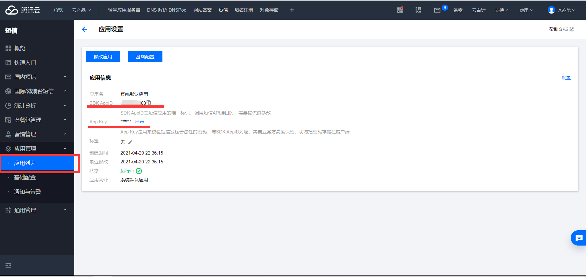
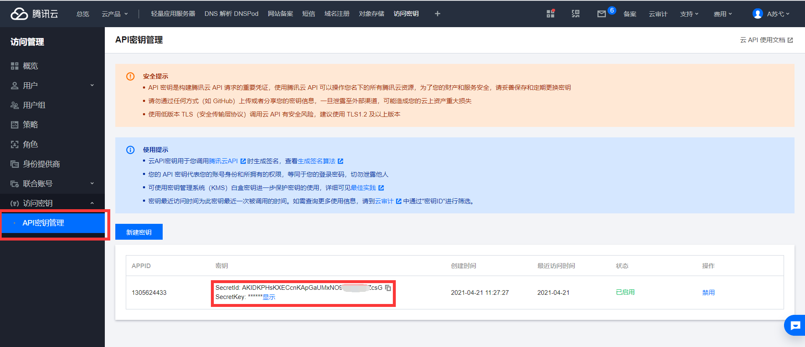
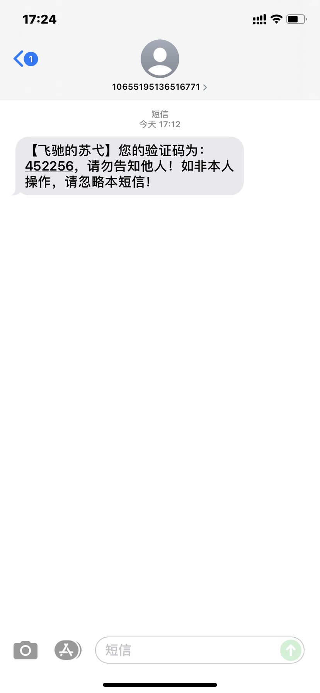

# java对接腾讯云短信发送

1. 创建签名
   

2. 创建正文模板
   

3. 找相关信息   **SDK AppID** 和  **App Key** 

   

4. 找到API密钥    记录**SecretId** 和 **SecretKey** 

   

5. 创项目导依赖

   ~~~xml
   <!--腾讯短信依赖-->
   <dependency>
       <groupId>com.tencentcloudapi</groupId>
       <artifactId>tencentcloud-sdk-java</artifactId>
       <version>4.0.11</version>
   </dependency>
   ~~~

   

6. 创建java类

   ~~~java
   package com.suyi.springcloud.test;
   
   import com.tencentcloudapi.common.Credential;
   import com.tencentcloudapi.common.exception.TencentCloudSDKException;
   import com.tencentcloudapi.common.profile.ClientProfile;
   import com.tencentcloudapi.sms.v20190711.SmsClient;
   import com.tencentcloudapi.sms.v20190711.models.SendSmsRequest;
   import com.tencentcloudapi.sms.v20190711.models.SendSmsResponse;
   
   public class SendCode {
       public static void main(String[] args) {
           // secretId，secretKey
           Credential cred = new Credential("secretId",
                   "secretKey");
   
           // 实例化要请求产品(以cvm为例)的client对象
           ClientProfile clientProfile = new ClientProfile();
           clientProfile.setSignMethod(ClientProfile.SIGN_TC3_256);
           SmsClient smsClient = new SmsClient(cred, "ap-chongqing");//第二个ap-chongqing 填产品所在的区
           SendSmsRequest sendSmsRequest = new SendSmsRequest();
           sendSmsRequest.setSmsSdkAppid("SDK AppID");//SDK AppID 
           String[] phones={"+86手机号"};  //发送短信的目标手机号，可填多个。
           sendSmsRequest.setPhoneNumberSet(phones);
           sendSmsRequest.setTemplateID("模版id");  //模版id
           String [] templateParam={"452256"};//模版参数，从前往后对应的是模版的{1}、{2}等
           sendSmsRequest.setTemplateParamSet(templateParam);
           sendSmsRequest.setSign("飞驰的苏弋"); //签名内容，不是填签名id节
           try {
               SendSmsResponse sendSmsResponse= smsClient.SendSms(sendSmsRequest); //发送短信
               System.out.println(sendSmsResponse.toString());
           } catch (TencentCloudSDKException e) {
               e.printStackTrace();
           }
       }
   }
   
   ~~~

   

# 方法二：

~~~java
package com.suyi.springcloud.test;

import com.tencentcloudapi.common.Credential;
import com.tencentcloudapi.common.exception.TencentCloudSDKException;
import com.tencentcloudapi.common.profile.ClientProfile;
import com.tencentcloudapi.common.profile.HttpProfile;
import com.tencentcloudapi.sms.v20190711.SmsClient;
import com.tencentcloudapi.sms.v20190711.models.*;

import java.util.Random;

public class SendCode2 {
public static void main(String[] args) {
    try {
        /* 必要步骤：
         * 实例化一个认证对象，入参需要传入腾讯云账户密钥对 secretId 和 secretKey
         * CAM 密钥查询：https://console.cloud.tencent.com/cam/capi
         */
        Credential cred = new Credential("AKIDKPHsKXECcnKApGaUMxNO9dMs88rZZcsG", "NWjHbkeP3SkqARdbJn1zkZEdmUyB7ost");
        SmsClient client = new SmsClient(cred, "");
        /* 实例化一个请求对象，根据调用的接口和实际情况，可以进一步设置请求参数*/
        SendSmsRequest req = new SendSmsRequest();
        /* SDKAppID*/
        String appid = "1400510188";
        req.setSmsSdkAppid(appid);
        /* 短信签名内容*/
        String sign = "飞驰的苏弋";
        req.setSign(sign);
        /*模板ID*/
        String templateID = "931520";
        req.setTemplateID(templateID);

        /* 86为国家码，最多不要超过200个手机号*/
        String[] phoneNumbers = {"+8617691324608","+8617392119275"};
        req.setPhoneNumberSet(phoneNumbers);

        /* 模板参数: 若无模板参数，则设置为空*/
        Random random = new Random();
        int code = random.nextInt(9000)+1000;//1000-9999
        String[] params = {String.valueOf(code)};
        req.setTemplateParamSet(params);

        /* 通过 client 对象调用 SendSms 方法发起请求。注意请求方法名与请求对象是对应的
         * 返回的 res 是一个 SendSmsResponse 类的实例，与请求对象对应 */
        SendSmsResponse res = client.SendSms(req);
        System.out.println(res);
        // 输出 JSON 格式的字符串回包
        System.out.println("字符串回包"+SendSmsResponse.toJsonString(res));

    } catch (TencentCloudSDKException e) {
        e.printStackTrace();
    }
}
}

~~~

