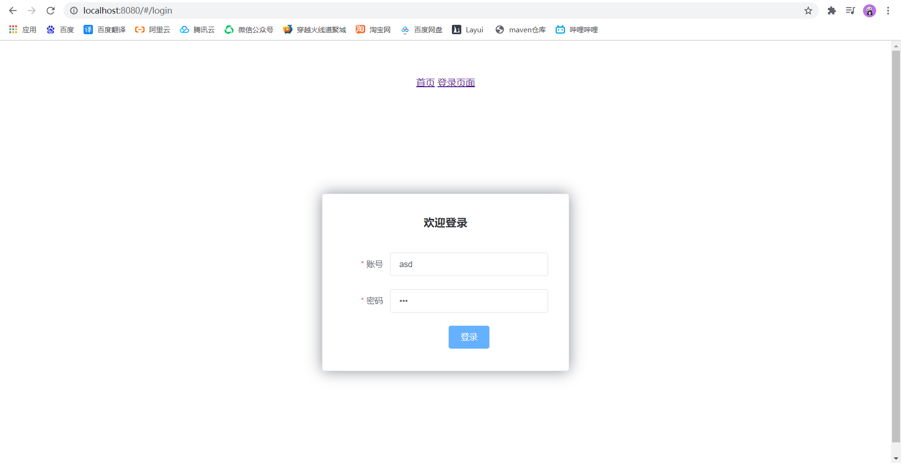
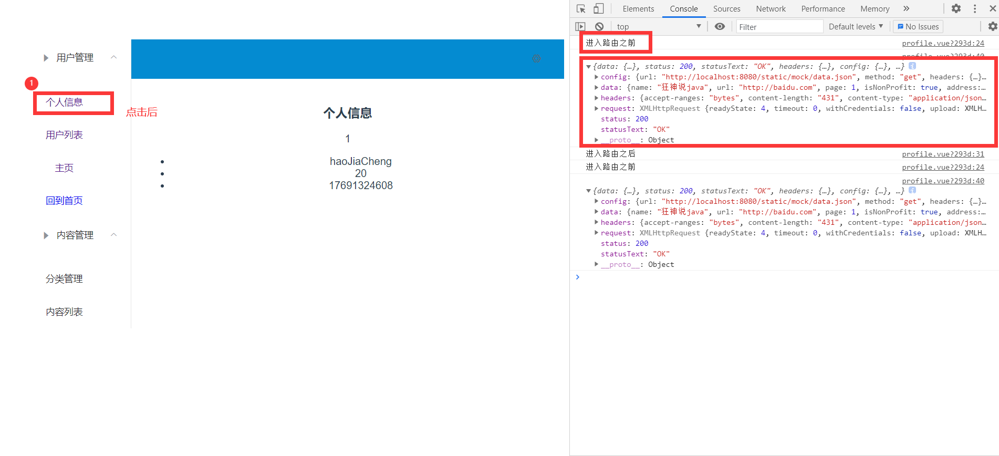

# vue+ElementUI

## 创建工程

1. 创建一个名为hello-vue的工程 `vue init webpack hello-vue`

2. 安装依赖，我们需要安装vue-router、element-ui、sass-loader和node-sass四个插件

   ~~~properties
   #进入工程目录
   cd hello-vue
   #安装 vue-router
   cnpm install vue-router --save-dev
   #安装 element-ui
   cnpm i element-ui -S
   #安装依赖
   cnpm install
   #安装 sass 加载器
   cnpm install sass-loader node-sass --save-dev
   #启动测试
   cnpm run dev
   ~~~
   安装报错，检查版本是否兼容，支持？

3. Npm命令解释：

   - npm install moduleName: 安装模块到项目目录下
   - npm install -g moduleName: -g的意思是将模块安装到全局，具体安装到磁盘哪个位置，要看npm config prefix的位置
   - npm install --save moduleName: --save的意思是将模块安装到项目目录下，并在package文件的dependencies节点写入依赖，-S为该命令的缩写
   - npm install --save-dev moduleName: --save-dev的意思是将模块安装到项目目录下，并在package文件的devDependencies节点写入依赖，-D为该命令的缩写

## 创建登陆页面

~~~vue
<template>

  <el-form ref="loginForm" :model="form" :rules="rules" label-width="80px" class="login-box">
  <h3 class="login-title">欢迎登录</h3>
  <el-form-item label="账号" prop="username">
  <el-input type="text" placeholder="请输入账号" v-model="form.username"/>
  </el-form-item>
  <el-form-item label="密码" prop="password">
  <el-input type="password" placeholder="请输入密码" v-model="form.password"/>
  </el-form-item>
  <el-form-item>
  <el-button type="primary" v-on:click="onSubmit(loginForm)">登录</el-button>
  </el-form-item>
  </el-form>

  <el-dialog
  title="温馨提示"
  :visible.sync="dialogVisible"
  width="30%"
  :before-close="handleClose">
  请输入账号和密码
  
  <el-button type=primary @click="dialogVisible = false">确 定</el-button>
  
  </el-dialog>

</template>

~~~

## 首页：

~~~vue
<template>

  <h1>首页</h1>
  <h2>{{message}}</h2>

</template>

~~~

## 路由：

router==》index.js

~~~js
import Vue from 'vue'
import Router from 'vue-router'
import hjc from "../components/hjc";
import login from "../components/login";

Vue.use(Router)

export default new Router({
  routes: [
    {
      path: '/',
      name: 'hjc',
      component: hjc
    },
    {
      path:'/hjc',
      name:'haojiacheng',
      component:hjc
    },
    {
      path:'/login',
      name:'login',
      component:login
    }
  ]
})

~~~

## 组件：

App.vue:

~~~vue
<template>
  

    <router-view></router-view>
  

</template>

~~~

## js文件：

main.js

~~~js
import Vue from 'vue'
import App from './App'

import router from './router'

import ElementUI from 'element-ui';
import 'element-ui/lib/theme-chalk/index.css';

Vue.config.productionTip = false

Vue.use(router);
Vue.use(ElementUI);

new Vue({
  el: '#app',
  router,
  render:h=>h(App)
})

~~~

## 运行：

`npm run dev`

# 传递参数和重定向

两种方法皆可传递对象或数组等参数

## 一、方法一

1. 页面传递参数

   ~~~vue
   <el-menu-item index="1-1">
    <router-link class="txt-under" :to="{name:'profile',params:{id:'1'}}">个人信息</router-link>
   </el-menu-item>
   ~~~

2. 配置路由参数接收

   ~~~js
   {
     path:'/hjc',
     name:'haojiacheng',
     component:hjc,
     children:[
       {path:'/user/profile/:id',name: 'profile',component:profile},
       {path:'/user/list',component:list},
       {path:'/main',component:main},
     ]
   },
   ~~~

3. 页面获取参数   注意：==$route==

   ~~~vue
   <template>
   

   <h1>个人信息</h1>
   
{{$route.params.id}}

   

   </template>
   ~~~

   

## 二、方法二

1. 开启props

   ~~~js
   {path:'/user/profile/:id',name: 'profile',component:profile,props:true},
   ~~~

2. 传递参数（对象 student）

   ~~~vue
   <router-link class="txt-under" :to="{name:'profile',params:{id:'1',student:student}}">个人信息</router-link>
   ~~~

3. 接收参数

   ~~~vue
   <template>
     

       <h1>个人信息</h1>
       
{{$route.params.id}}

       <ul>
         <li v-for="item of student">{{item}}</li>
       </ul>
     

   </template>
   
   
   ~~~

## 路由模式

路由模式有两种

- hash：路径带 # 号，如http://localhost:8080/#/login
- history: 路径不带 # 号，如http://localhost:8080/login

修改路由配置，代码如下：

~~~js
export default new Router({
mode:'history',
})
~~~

## 404

**处理404**创建一个名为`NotFound.vue` 的视图组件，代码如下

~~~vue
<template>

  <h1>您访问的页面不存在！</h1>

</template>

~~~

配置路由  index.js:

~~~js
{
  path:'*',
  component:NotFound
}
~~~

## 路由钩子与异步请求

beforeRouterEnter： 在进入路由前执行

beforeRouterLeave： 在离开路由前执行

上代码：

~~~js
beforeRouteEnter:(to, from, next)=>{
console.log("进入路由之前");
next(vm => {
  vm.getData()
});

},
beforeRouteLeave:(to, from, next)=>{
console.log("进入路由之后");
next();
},
~~~

参数说明：

- to：路由将要跳转的路径信息
- from：路径跳转前的路径信息
- next：路由的控制参数
  - next（）跳入下一个页面
  - next（'/path'）改变路由的跳转方向
  - next（false）返回原来的页面
  - next（vm=>{}）仅在beforeRouteEnter中可用，vm是组件实例

**在钩子函数中使用异步请求**

1. 安装axios vue-axios    `cnpm install --save axios vue-axios`

2. main.js 引用Axios

   ~~~js
   import axios from 'axios';
   import VueAxios from 'vue-axios';
   Vue.use(VueAxios,axios);
   ~~~

3. 在beforeRouteEnter中进行异步请求

   ~~~js
   methods:{
   getData:function () {
     this.axios({
       method:'get',
       url:'http://localhost:8080/static/mock/data.json'
     }).then(function (response) {
       console.log(response)
     })
   }
   }
   ~~~

4. 导入json文件，放入static下的mock中  data.json

   ~~~json
   {
     "name":"狂神说java",
     "url": "http://baidu.com",
     "page": 1,
     "isNonProfit":true,
     "address": {
       "street": "含光门",
       "city":"陕西西安",
       "country": "中国"
     },
     "links": [
       {
         "name": "B站",
         "url": "https://www.bilibili.com/"
       },
       {
         "name": "4399",
         "url": "https://www.4399.com/"
       },
       {
         "name": "百度",
         "url": "https://www.baidu.com/"
       }
     ]
   }
   
   ~~~

5. npm run dev  运行访问结果如下：
   

